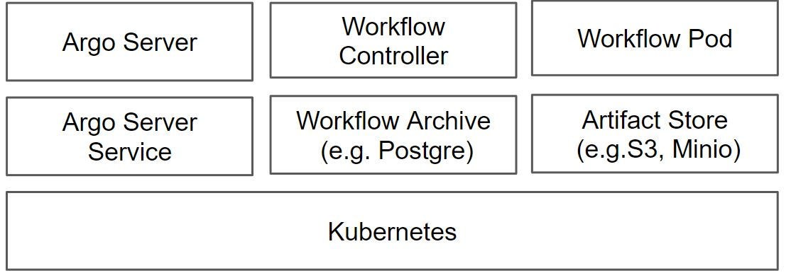

# Kubeflow Pipelines

Kubeflow Pipelines(KFP)은ML Workflow를 구축하고 배포하기 위한 ML Workflow Orchestration 도구이다.&#x20;

KFP의 목표는 Pipelines과 Pipeline Components를 재사용하여 다양한 실험을 쉽게 수행하는 것이다. Pipelines은 Pipeline Components을 연결해서 DAG (Directed Acyclic Graph) 형태로 Workflow를 구성할 수 있으며, Workflow Engine으로 CNCF 에 포함되어 있는 Argo Workflow 를 사용한다.

### Argo Workflow <a href="#kubeflowpipelines-argoworkflow" id="kubeflowpipelines-argoworkflow"></a>

컨테이너 기반으로 ML Pipelines, Data processing, ETL, CI/CD  구축 등에 사용한다.

Workflows는 Kubernetes CRD로 작성하며, Workflows의 각 Step은 컨테이너로 정의하고 이것들을 연결하여 Pipeline 구성한다.&#x20;

주요 구성요소는 Argo Server, Workflow Controller, Workflow Archive, Artifact Store 가 있다.



동작 방법은 다음과 같다.

1\. Workflow CR YAML 작성하여 Kubernetes에 요청하면 etcd에 workflow CR을 저정한다.

2\. Argo Workflow Controller 가 Reconcilation 루프에서 etcd의 정보를 확인하고 kube-scheduler에 파드 생성을 요청한다.

3\. kube-scheduler는 파드를 적절한 노드에 스케줄링한다.

4\. Argo Workflow Controller 가 다음 Reconcilation 루프에서 다음 dependency의 job을 요청한다.

### Kubeflow Pipeline (KFP) <a href="#kubeflowpipelines-kubeflowpipeline-kfp" id="kubeflowpipelines-kubeflowpipeline-kfp"></a>

KFP는 Argo와 달리 주로 ML Workflow 용도다.

다음은 KFP 활용하여 ML Worflow 구축하고 배포하는 과정이다.


1\. Kubeflow Dashboard > Experiments (KFP)에서 Experiment를 생성한다. (Create Experiment )

2\. Jupyter Notebook 혹은 Python IDE에서 KFP Python SDK를 사용하여 ML Pipeline 코드를 작성한다. (Write Pipeline)

3\. 작성한 Pipeline  파이썬 코드를 Argo Workflow CR YAML로 변환한다. (Convert Pipeline to Workflow CR YAML)

4\. Kubeflow Dashboard > Pipelines 에서 Argo Workflow CR YAML을 Upload 한다 (Upload Pipeline).

5\. Kubeflow Dashboard > Pipelines 에서 Upload한 Pipeline을 Run 한다. (Create Run → Start Run)

### KFP Architecture <a href="#kubeflowpipelines-kfparchitecture" id="kubeflowpipelines-kfparchitecture"></a>


#### **KFP Python SDK** <a href="#kubeflowpipelines-kfppythonsdk" id="kubeflowpipelines-kfppythonsdk"></a>

SDK를 사용하여 Pipeline Components 생성하거나 Pipelines 구성한다.

#### **Pipeline Service** <a href="#kubeflowpipelines-pipelineservice" id="kubeflowpipelines-pipelineservice"></a>

Pipeline Service는 Pipeline 배포를 담당한다.

#### **Kubernetes Resource** <a href="#kubeflowpipelines-kubernetesresource" id="kubeflowpipelines-kubernetesresource"></a>

Kubernetes API Server는 Pipeline Service에서 전달 받은 Pipeline 정보로 Kubernetes Resource를 생성한다.

#### **Orchestration Controller** <a href="#kubeflowpipelines-orchestrationcontroller" id="kubeflowpipelines-orchestrationcontroller"></a>

Argo Workflow는 Pipeline을 실행하는데 필요한 Kubernetes Pod로 실행한다.

#### **Artifact Store** <a href="#kubeflowpipelines-artifactstore" id="kubeflowpipelines-artifactstore"></a>

Metadata와 Artifact 파드가 있다.

Metadata (e.g. MySQL)는 KFP의 Metadata를 저장한다.

데이터(e.g. Large Data, Binary)가 클 경우, Artifact Store (e.g. Minio)에 저장해두고 그 저장정보를 Pipeline Component간의 주고 받아 데이터를 활용한다.

#### **Pipeline Persistence Agent** <a href="#kubeflowpipelines-pipelinepersistenceagent" id="kubeflowpipelines-pipelinepersistenceagent"></a>

Pipeline Service에서 배포한 Kubernetes Resource를 감시한다.

#### **Pipeline Web Server** <a href="#kubeflowpipelines-pipelinewebserver" id="kubeflowpipelines-pipelinewebserver"></a>

실행 중인 Pipeline 목록, Pipeline 실행 기록, 데이터 Artifact 목록 등의 데이터를 수집한다.

#### **KFP UI** <a href="#kubeflowpipelines-kfpui" id="kubeflowpipelines-kfpui"></a>

**Experiments (KFP)**

KFP의 Workspace로 Experiment를 관리한다. Experiment 마다 시도한 Runs을 포함한다.

**Pipelines**

Pipeline을 관리한다.

**Runs**

Pipeline을 실행한 Run 목록을 관리하며, Pipeline에서 Step 별로 수행한 Graph, Run output, Config 등을 제공한다.

Recurring Run은 반복되는 Run이다.

**Artifacts**

Artifact는 Model 학습 혹은 검증 과정에서 사용하거나 생성한 Input/Output 데이터 정보를 확인한다.

### KFP Python SDK <a href="#kubeflowpipelines-kfppythonsdk.1" id="kubeflowpipelines-kfppythonsdk.1"></a>

SDK를 사용하여 Pipeline Components를 작성하거나 Pipelines 구성한다.

Component는 Ingest Data, Generate Statistics, Preprocess Data, Transform Data, Train Model 과 같은 실제 Job을 수행하는 Runtime 코드와 외부 시스템과 연계하기 위한 Client 코드로 구분한다.

코드를 작성한 후, DSL Compiler 사용해  Workflow CR YAML로 변환한다.


#### **kfp.dsl** <a href="#kubeflowpipelines-kfp.dsl" id="kubeflowpipelines-kfp.dsl"></a>

Pipeline Components 작성하는데 사용한다.

**kfp.dsl.ContainerOp**

Pipeline Components를 특정 컨테이너 이미지로 정의할 때 사용하며, image, command, arguments 등을 지정하여 Components를 정의할 수 있다.


```python
import kfp.dsl as dsl
 
def training_op(learning_rate: float,
                num_layers: int,
                optimizer='ftrl',
                step_name='training'):
     
    return dsl.ContainerOp(
        name=step_name,                                                           # Component 이름
        image='katib/mxnet-mnist-example',                                        # 사용할 이미지
        command=['python', '/mxnet/example/image-classification/train_mnist.py'], # 컨테이너 이미지에서 실행할 명령어
        arguments=[                                                               # 컨테이너 이미지에서 실행할 명렁어의 실행 인자값
            '--batch-size', '64',
            '--lr', learning_rate,
            '--num-layers', num_layers,
            '--optimizer', optimizer
        ],
        file_outputs={'output': '/etc/timezone'}                                  # 컨테이너 결과를 외부로 노출
  )
 
 
def postprocessing_op(output,
                      step_name='postprocessing'):
    return dsl.ContainerOp(
        name=step_name,
        image='library/bash:4.4.23',
        command=['sh', '-c'],
        arguments=['echo "%s"' % output]
    )
```


**kfp.dsl.ResourceOp**

Kubernetes Resource를 생성하거나 관리하는 Pipeline Components를 만든다.

**kfp.dsl.VolumeOp**

Kubernetes PVC를 생성하는 Pipeline Components를 만든다.

**kfp.dsl.PipelineParam**

Pipeline Components 간의 파라미터를 전달할 때 사용한다.

**kfp.dsl.pipeline**

Pipeline Components 연결하여 Pipeline을 구성하고, 구성한 Pipeline을 반환한다. (반환된 Pipeline은 kfp.compiler로 컴파일하여 Workflow CR YAML 파일로 변환할 수 있다.)


```python
@dsl.pipeline(
  name='Pipeline GPU Example',
  description='Demonstrate the Kubeflow pipelines SDK with GPUs'
)
def kubeflow_training(
  learning_rate: dsl.PipelineParam = dsl.PipelineParam(name='learningrate', value=0.1),
  num_layers: dsl.PipelineParam = dsl.PipelineParam(name='numlayers', value='2'),
  optimizer: dsl.PipelineParam = dsl.PipelineParam(name='optimizer', value='ftrl')):
     
    training = training_op(learning_rate, num_layers, optimizer).set_gpu_limit(1)
    postprocessing = postprocessing_op(training.output)
```


#### **kfp.compiler** <a href="#kubeflowpipelines-kfp.compiler" id="kubeflowpipelines-kfp.compiler"></a>

kfp.dsl로 작성한 Pipelines 코드를 DSL Compiler를 사용하여 Workflow CR YAML 파일로 변환한다.


```python
if __name__ == '__main__':
    import kfp.compiler as compiler
    compiler.Compiler().compile(kubeflow_training, __file__ + '.yaml')
```


#### kfp.Client <a href="#kubeflowpipelines-kfp.client" id="kubeflowpipelines-kfp.client"></a>

Kubernetes에 설치한 Kubeflow Pipeline 클라이언트이다. Pipeline 업로드, Experiment 생성, Run 생성 등의 API를 제공한다.

**create\_experiment**

Experiment(KFP) 를 생성하고 Experiment object를 리턴한다.

**run\_pipeline**

Pipeline 실행하고 Run object 리턴한다.

**create\_run\_from\_pipeline\_func**

Pipeline을 컴파일하고 Kubeflow Pipeline에 Submit 한다.

**upload\_pipeline\_version**

Pipeline을 Kubeflow Pipeline에 upload한다.

Client를 생성하는 방법은 다음과 같다.

```
IN_CLUSTER_DNS_NAME= 'ml-pipeline.{}.svc.cluster.local:8888'
KUBE_PROXY_PATH= 'api/v1/namespaces/{}/services/ml-pipeline:http/proxy/'
LOCAL_KFP_CONTEXT= '/home/docs/.config/kfp/context.json'
NAMESPACE_PATH= '/var/run/secrets/kubernetes.io/serviceaccount/namespace'
```

#### kfp.components  <a href="#kubeflowpipelines-kfp.components" id="kubeflowpipelines-kfp.components"></a>

Pipeline Components 는 ML Workflow에서 어떤 Step을 수행하는 코드이다.

Pipeline Component Specification은 다음과 같이 정의할 수 있다.

1\. Component의 metadata를 정의한다. (name, description 등)

2\. Component의 inputs, outputs 항목을 정의한다.

3\. Component의 implementation 항목에 코드를 실행할 컨테이너와 그 코드를 실행할 command, arguments 를 정의한다.

Pipeline Components간의 데이터를 데이터를 주고 받을 때, KFP Component에서 제공하는 InputPath와 OutputPath 파라미터 어노테이션을 사용한다.

InputPath와 OutputPath의 데이터 타입은 파이썬 타입이거나 TFModel 도 가능하다.


```yaml
name: xgboost4j - Train classifier
description: Trains a boosted tree ensemble classifier using xgboost4j
 
inputs:
- {name: Training data}
- {name: Rounds, type: Integer, default: '30', description: 'Number of training rounds'}
 
outputs:
- {name: Trained model, type: XGBoost model, description: 'Trained XGBoost model'}
 
implementation:
  container:
    image: gcr.io/ml-pipeline/xgboost-classifier-train@sha256:b3a64d57
    command: [
      /ml/train.py,
      --train-set, {inputPath: Training data},
      --rounds,    {inputValue: Rounds},
      --out-model, {outputPath: Trained model},
    ]
```


**kfp.components.func\_to\_container\_op**

Python 함수를 Pipeline Component로 변환한다.

**kfp.components.load\_component\_from\_file**

YAML 파일로 정의한 Pipeline component를 로드한다.

**kfp.components.load\_component\_from\_url**

YAML 파일로 정의한 Pipeline component를 URL로 부터 로드한다.

### ML Workflow 작성 예제


KFP Component를 이용한 ML Workflow 예제 &#x20;

다음 URL의 예제는  Katib에서 찾은 하이퍼파라미터를 사용하여 TFJob으로 ML 모델을 생성하고, 그 ML 모델로 예측시스템을 구축한 파이프라인 예제이다.

[https://github.com/kubeflow/pipelines/blob/master/samples/contrib/kubeflow-e2e-mnist/kubeflow-e2e-mnist.ipynb](https://github.com/kubeflow/pipelines/blob/master/samples/contrib/kubeflow-e2e-mnist/kubeflow-e2e-mnist.ipynb)

### 용어 <a href="#kubeflowpipelines" id="kubeflowpipelines"></a>

**MinIO (Minimal Object Storage)**

MinIO는 오픈소스로 제공되는 오브젝트 스토리지 서버이며, AWS S3와 호환되는 클라우드 스토리지를 구축할 수 있는 도구이다.

Minio Server, Minio Client, Minio Library를 제공한다.

**Reconciliation**

조정은 두 개의 레코드 세트가 일치하는지 확인하는 프로세스이다.

### 참고자료 <a href="#kubeflowpipelines" id="kubeflowpipelines"></a>

Argo Workflow Concepts, [https://github.com/argoproj/argo-workflows/blob/master/examples/README.md](https://github.com/argoproj/argo-workflows/blob/master/examples/README.md)\


Argo Workflow Architecture, https://github.com/argoproj/argo-workflows[\
https://github.com/argoproj/argo-workflows/blob/master/docs/architecture.md](https://github.com/argoproj/argo-workflows/blob/master/docs/architecture.md)

Argo Workflow CRD, [https://github.com/argoproj/argo-workflows/tree/master/manifests/base/crds/full](https://github.com/argoproj/argo-workflows/tree/master/manifests/base/crds/full)

KFP Concepts, [https://www.kubeflow.org/docs/components/pipelines/overview/concepts/](https://www.kubeflow.org/docs/components/pipelines/overview/concepts/)

KFP Building, [https://www.kubeflow.org/docs/components/pipelines/sdk/build-pipeline/](https://www.kubeflow.org/docs/components/pipelines/sdk/build-pipeline/)

KFP Python SDK Examples, [https://github.com/kubeflow/pipelines/tree/master/samples/tutorials](https://github.com/kubeflow/pipelines/tree/master/samples/tutorials)

KFP Client, [https://kubeflow-pipelines.readthedocs.io/en/latest/source/kfp.client.html](https://kubeflow-pipelines.readthedocs.io/en/latest/source/kfp.client.html)\
[https://www.kubeflow.org/docs/components/pipelines/sdk/connect-api/](https://www.kubeflow.org/docs/components/pipelines/sdk/connect-api/)

KFP Backend, [https://github.com/kubeflow/pipelines/tree/master/backend](https://github.com/kubeflow/pipelines/tree/master/backend)

KFP Component Spec, [https://www.kubeflow.org/docs/components/pipelines/sdk/component-development/#component-spec](https://www.kubeflow.org/docs/components/pipelines/sdk/component-development/#component-spec)

KFP Architecture, [https://github.com/kubeflow/kfp-tekton](https://github.com/kubeflow/kfp-tekton)\
[https://betterprogramming.pub/kubeflow-pipelines-with-gpus-1af6a74ec2a](https://betterprogramming.pub/kubeflow-pipelines-with-gpus-1af6a74ec2a)\
[https://www.slideshare.net/AnimeshSingh/kubeflow-pipelines-with-tekton-236769976](https://www.slideshare.net/AnimeshSingh/kubeflow-pipelines-with-tekton-236769976)

KFP Samples. [https://github.com/kubeflow/pipelines/tree/master/samples/contrib](https://github.com/kubeflow/pipelines/tree/master/samples/contrib)\
[https://github.com/kubeflow/pipelines/blob/master/samples/contrib/kubeflow-e2e-mnist/kubeflow-e2e-mnist.ipynb](https://github.com/kubeflow/pipelines/blob/master/samples/contrib/kubeflow-e2e-mnist/kubeflow-e2e-mnist.ipynb)

