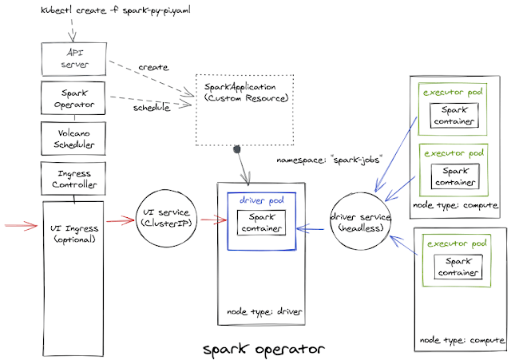

# Kubernetes Spark Operator

## Kubernetes Spark Operator

Kubernetes에서 Spark Application를 구동하려면 Spark-submit, Spark on Kubernetes Operator를 사용할 수 있다.


여기서는 Kubernetes Spark Operator를 사용 것에 대해 알아본다.



### Spark Operator 구축

헬름 차트를 사용해 Spark Operator를 설치한다.

Spark Job namespace 생성한다.

```bash
kubectl apply -f spark-jobs-ns.yaml
```

```yaml
apiVersion: v1
kind: Namespace
metadata:
  name: spark-jobs
```

Spark Operator 헬름 차트를 레포에 등록하고 Operator는 spark-operator, Application은 spark-jobs namespace를 지정하여 Operator를 설치한다.

```yaml
helm3 repo add spark-operator https://googlecloudplatform.github.io/spark-on-k8s-operator
helm3 repo update
helm3 install spark-starter spark-operator/spark-operator --namespace spark-operator --create-namespace --set sparkJobNamespace=spark-jobs --set serviceAccounts.spark.name=spark
helm3 status --namespace spark-operator spark-starter
```

### Spark Operator 이용한 Spark Job 예제

Spark Job 을 생성하고 실행한다.

```yaml
kubectl apply -f examples/spark-pi.yaml
```

```yaml
apiVersion: "sparkoperator.k8s.io/v1beta2"
kind: SparkApplication
metadata:
  name: spark-pi
  namespace: spark-jobs
spec:
  type: Scala
  mode: cluster
  image: "gcr.io/spark-operator/spark:v3.1.1"
  imagePullPolicy: Always
  mainClass: org.apache.spark.examples.SparkPi
  mainApplicationFile: "local:///opt/spark/examples/jars/spark-examples_2.12-3.1.1.jar"
  sparkVersion: "3.1.1"
  restartPolicy:
    type: Never
  volumes:
    - name: "test-volume"
      hostPath:
        path: "/tmp"
        type: Directory
  driver:
    cores: 1
    coreLimit: "1200m"
    memory: "512m"
    labels:
      version: 3.1.1
    serviceAccount: spark
    volumeMounts:
      - name: "test-volume"
        mountPath: "/tmp"
  executor:
    cores: 1
    instances: 1
    memory: "512m"
    labels:
      version: 3.1.1
    volumeMounts:
      - name: "test-volume"
        mountPath: "/tmp"
```

완료된 Spark Job 을 삭제한다.

```yaml
kubectl delete -f examples/spark-pi.yaml
kubectl -n spark-jobs describe sparkapplications.sparkoperator.k8s.io spark-pi
kubectl -n spark-jobs get all
```

필요하면 Spark Operator를 삭제한다.

```yaml
helm3 uninstall spark-operator
helm3 -n spark-operator delete spark-starter
```

### 참고자료

[https://aws.amazon.com/ko/blogs/compute/running-cost-optimized-spark-workloads-on-kubernetes-using-ec2-spot-instances/](https://aws.amazon.com/ko/blogs/compute/running-cost-optimized-spark-workloads-on-kubernetes-using-ec2-spot-instances/)\
[https://www.datamechanics.co/blog-post/setting-up-managing-monitoring-spark-on-kubernetes](https://www.datamechanics.co/blog-post/setting-up-managing-monitoring-spark-on-kubernetes)\
[https://dev.to/stack-labs/my-journey-with-spark-on-kubernetes-in-python-1-3-4nl3](https://dev.to/stack-labs/my-journey-with-spark-on-kubernetes-in-python-1-3-4nl3)\
[https://kubernetes.io/docs/tasks/administer-cluster/namespaces/](https://kubernetes.io/docs/tasks/administer-cluster/namespaces/)\
[https://github.com/GoogleCloudPlatform/spark-on-k8s-operator/blob/master/docs/quick-start-guide.md#running-the-examples](https://github.com/GoogleCloudPlatform/spark-on-k8s-operator/blob/master/docs/quick-start-guide.md#running-the-examples)\
[https://github.com/GoogleCloudPlatform/spark-on-k8s-operator/issues/454https://spark.apache.org/downloads.html](https://github.com/GoogleCloudPlatform/spark-on-k8s-operator/issues/454https://spark.apache.org/downloads.html) \
[https://mirror.navercorp.com/apache/spark/spark-3.1.2/spark-3.1.2-bin-hadoop3.2.tgz](https://mirror.navercorp.com/apache/spark/spark-3.1.2/spark-3.1.2-bin-hadoop3.2.tgz)\
[https://www.youtube.com/watch?v=SqKlPiv\_RRg](https://www.youtube.com/watch?v=SqKlPiv\_RRg)\
[https://www.slideshare.net/seungyongoh3/rearchitecting-data-platform-with-kubernetes](https://www.slideshare.net/seungyongoh3/rearchitecting-data-platform-with-kubernetes)
