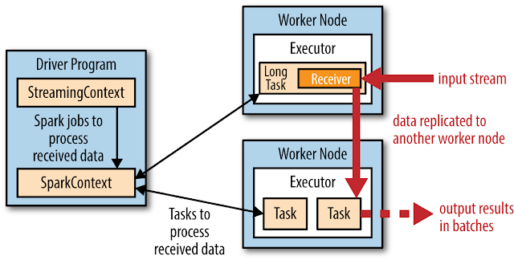
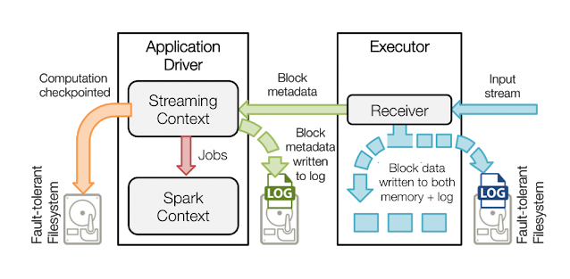
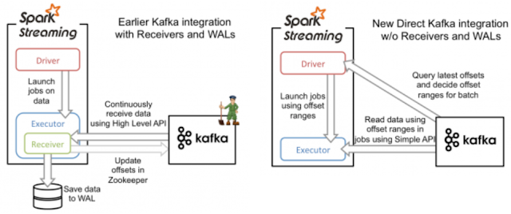

# Spark Streaming Fault-tolerant

Spark의 RDD는 장애 복구 기능을 가지고 있다. RDD 는 변경 불가능하고, 연산 순서를 기억하고(lineage) 있어서 다시 만들 수 있는 분산 데이터셋이다. 워커 노드의 오류 때문에 RDD 의 어떤 부분이 유실되면 그 부분의 연산 순서를 사용하여 다시 생성할 수 있다. Spark Streaming의 DStream 도 RDD를 근간으로 하기 때문에 복원할 수 있다.

## 데이터 유실 문제

Spark는 기본적으로 장애 복구 기능을 가지고 있어서 HDFS, S3 등을 데이터 소스로 사용하는 경우에는 데이터가 유실되지 않는다. 하지만 네트워크를 통해서 데이터를 수신하는 경우(예, kafka, flume)에는 데이터가 유실될 수 있다.

Spark Streaming 에서 Receiver를 사용할 경우, Receiver는 데이터 유실을 막기 위해서 네트워크를 통해서 받은 데이터를 다른 노드에 복제하기 때문에(디폴트 복제 인자: 2), 워커 노드가 실패할 때 복사본으로 유실된 데이터를 복구할 수 있다.



그러나 Receiver가 있는 워커 노드에서 장애가 발생할 경우에는 Receiver에서 다른 워커노드로 복제되지 않고 버퍼에 남아 있는 데이터는 유실될 수 있다. 이러한 데이터 유실 문제를 해결하기 위해서 Spark 1.2 버전에서는 Write Ahead Logs(WAL) 을 도입했다.

## Write Ahead Logs (WAL) 사용

WAL 을 사용하면 드라이버, 마스터 혹은 워커노드에서 장애가 발생하더라도 입력 데이터가 유실되는 것을 방지할 수 있다. 스파크 설정 파일에서 WAL 사용 설정하고 StreamingContext 를 체크포인트하면 장애가 발생할 때 체크포인트를 복구하여 데이터도 복구할 수 있다.

```bash
spark.streaming.receiver.writeAheadLog.enable true
```



WAL을 사용하면 데이터가 유실되는 문제는 해결할 수 있지만, 데이터가 중복될 수 있다. 예를 들어, 데이터를 WAL 에 저장하고 **Kafka Offset 을 Zookeeper 에 업데이트하지 못한 상태에서 장애가 발생**하면, Spark Streaming 은 Kafka 에서 데이터를 다시 가져와 중복 처리하는 문제가 발생한다. (at-least-one)

데이터 중복 처리 문제를 해결하기 위해 Spark 1.3 버전에서는 **Direct Kafka API** 도입하였다

## Direct Kafka API

데이터 수신 완료 여부를 2개의 시스템에서 관리하면, 원자성을 가지고 업데이트할 수 없기 때문에 불일치성이 발생한다. 불일치성을 해결하기 위해 1개의 시스템에서 데이터 수신을 관리할 필요가 있다. Spark Streaming 은 Kafka의 Simple Consumer API 를 사용하여 **offset 을 Spark Streaming 에서 직접 관리**하는 구조로 변경하여 이를 해결하였다.

이 방식은 Receiver 와 WAL 을 사용하여 데이터 유실을 방지하는 접근 방식과 다르다. Receiver를 사용하여 데이터를 수신하고 WAL 에 저장하는 대신에 매 배치간격(Batch Interval)마다 Consume 한 데이터의 offset range을 설정하고 나중에 Batch Jobs을 실행할 때, offset range 설정에 따라 데이터를 Kafka Broker에서 읽어오고 offset을 checkpoint하고 복구할 때 사용한다.

**Spark Streaming 은 Direct Kafka API 를 사용함으로써 데이터 유실을 방지하고 중복 없이 정확하게 한번(Exactly-one)만 처리할 수 있다.**



사용법은 다음과 같다.

#### **체크포인트**

```scala
val CHECKPOINT_DIR = getCheckpointDirectory(SERVICE_NAME)
val ssc = if (isCheckpointing) {
  StreamingContext.getOrCreate(CHECKPOINT_DIR,
  () => {
    analyzer(sparkConf, SERVICE_NAME, CHECKPOINT_DIR)
  })
} else {
  analyzer(sparkConf, SERVICE_NAME, CHECKPOINT_DIR)
}
…
val ssc = new StreamingContext(sparkConf, SLIDE_INTERVAL)
if (isCheckpointing) {
  ssc.checkpoint(checkpointDirectory)
}
```

#### **Direct Kafka 연동**

```scala
val KAFKA_TOPIC = Configuration.getKafkaTopic()
val DIRECT_KAFKA_PARAMS = Map("metadata.broker.list" -> Configuration.getKafkaBrokerList)
val DIRECT_TOPICS = Set(KAFKA_TOPIC)
val kafkaStreams = KafkaUtils.createDirectStream[String, String, StringDecoder, StringDecoder](ssc, DIRECT_KAFKA_PARAMS, DIRECT_TOPICS)
kafkaStreams.map { case (k, v) => v }
```

Direct Kafka API를 사용하면 Receiver 가 필요없기 때문에 Receiver (Kafka Consumer) 당 Kafka Partition 을 구성할 필요가 없고 각 Kafka Partition 별로 RDD Partition 생성해 데이터를 읽어올 수 있다.

Spark Streaming은 Fault-tolerant를 보장하기 위한 Kafka 연동 방식은 Checkpointing 과 함께 사용해야 한다. 만약 Spark 어플리케이션을 재컴파일하여 재배포해야 한다면 이전 바이너리로 checkpoint한 Context 를 다시 생성할 수 없기 때문에 checkpoint Directory를 삭제하고 Spark 어플리케이션을 실행해야 한다.

## 용어

ACID(원자성, 일관성, 고립성, 지속성)

ACID 원자성 (Atomicity)\
트랜잭션을 성공적으로 완료하면, 항상 일관성 있는 데이터베이스 유지해야 한다.

ACID 지속성 (Durability)\
파일시스템 혹은 데이터베이스에 성공적으로 완료한 트랜잭션은 영원히 반영되어야 한다.

### 참고자료

Improvements to Kafka integration of Spark Streaming, [https://databricks.com/blog/2015/03/30/improvements-to-kafka-integration-of-spark-streaming.html](https://databricks.com/blog/2015/03/30/improvements-to-kafka-integration-of-spark-streaming.html)\
Improved Fault-tolerance and Zero Data Loss in Spark Streaming, [https://databricks.com/blog/2015/01/15/improved-driver-fault-tolerance-and-zero-data-loss-in-spark-streaming.html](https://databricks.com/blog/2015/01/15/improved-driver-fault-tolerance-and-zero-data-loss-in-spark-streaming.html)\
Integrating Kafka and Spark Streaming: Code Examples and State of the Game, [http://www.michael-noll.com/blog/2014/10/01/kafka-spark-streaming-integration-example-tutorial/](http://www.michael-noll.com/blog/2014/10/01/kafka-spark-streaming-integration-example-tutorial/)\
Exactly-once Spark Streaming from Apache Kafka,[ http://blog.cloudera.com/blog/2015/03/exactly-once-spark-streaming-from-apache-kafka/](http://blog.cloudera.com/blog/2015/03/exactly-once-spark-streaming-from-apache-kafka/)

