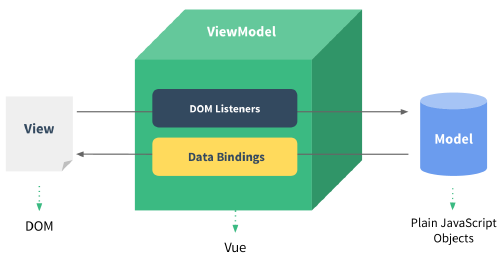

## Vue.js

### MVVM (Model - View - View Model)

로직과 UI를 분리하기 위해 설계한 패턴으로 재사용가능한 화면을 컴포넌트로 만들어 사용한다.

Vue는 Virtual DOM이 변경될 때마다 Real Dom과 비교해서 차이나 부분만 수정하기 때문에 빠르다.

### Component

재사용 가능한 화면을 컴포넌트로 만들어 사용한다.

컴포넌트는 트리로 구성되어 있다.

하위 컴포넌트는 변경 사항을 $emit 내장함수를 사용하여 상위 컴포넌트에 전달할 수 있고
상위 컴포넌트가 변경되면 하위 컴포넌트는 props를 통해 정보를 얻을 수 있다.

### Virutal DO

Vue는 Virtual DOM이 변경될 때마다 Real DOM과 비교해서 차이나는 부부만 수정하기 때문에 빠르다.
컴포넌트의 변경사항을 다른 컴포넌트에 적용하려면, watcher를 사용하여 변경 내용을 추적할 수 있다.

### Life Cycle

생명 주기는 크게 Creation, Mounting, Updating, Destruption으로 나눈다.

## Example

